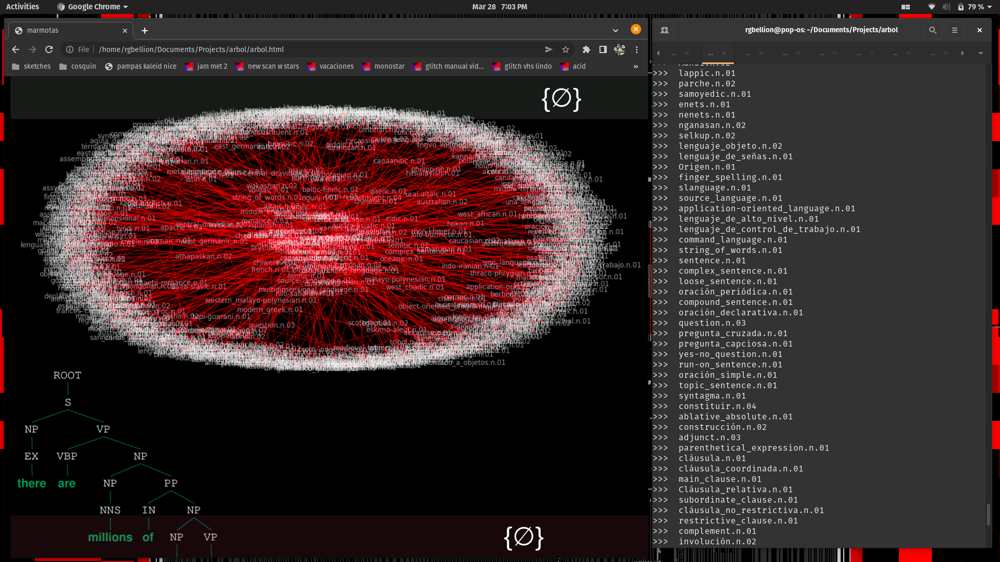

arbol
============

¿¿¿????

Entorno de generación de ASTs en vivo

búsqueda y dibujado de hiperónimos e hipónimos

para performance en vivo con Marmotas Dream

Software MADE IN CÓRDOBA, ARGENTINA

Maxima SEMIOSIS

por KAREN PALACIO aka kardaver

# Instalar y Correr

> Muchos prerequisitos (estàs avisade)

# Instalación

Testeado solo para python 3.8

Crear virtualenv con requerimientos de requirements.txt

`
pip install -r requirements.txt
`

Bajarse el stanford core NLP server

# Correr

Mantener corriendo stanford core NLP  server (en port 9000)
`
java -mx4g -cp "*" edu.stanford.nlp.pipeline.StanfordCoreNLPServer -port 9000 -timeout 15000
` 

Tener abierta index.html en un navegador

levantar servidores de python

`
bash run.sh
`

`
python3 word_graph.py
`

# servers

sabiendo que syntax_tree se cae, para correrlo tranquilamente durante la performance levantar un nohup process

usando el script de bash

bash ./run.sh

eso levanta un proceso en el background, para terminarlo despues hacer

`
ps -ef | grep "run.sh"
`

y 

`
kill PID
`

# Recursos

* [hyponym graph copy pasted from](https://stackoverflow.com/questions/39824133/networkx-and-wordnet)
